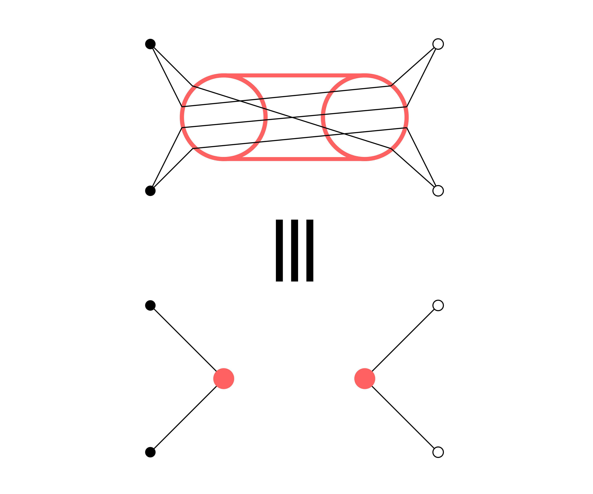
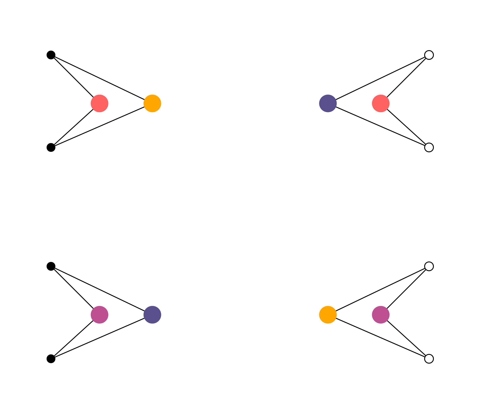
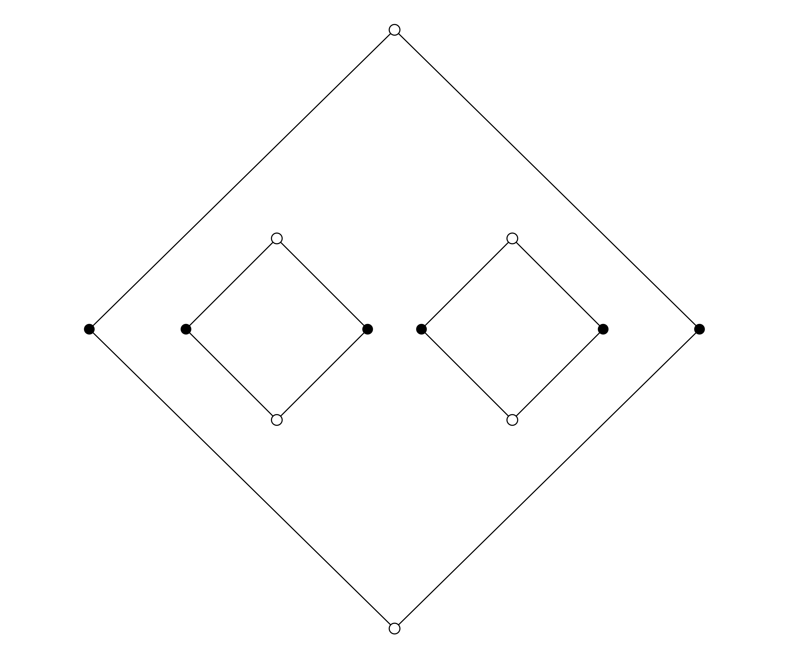
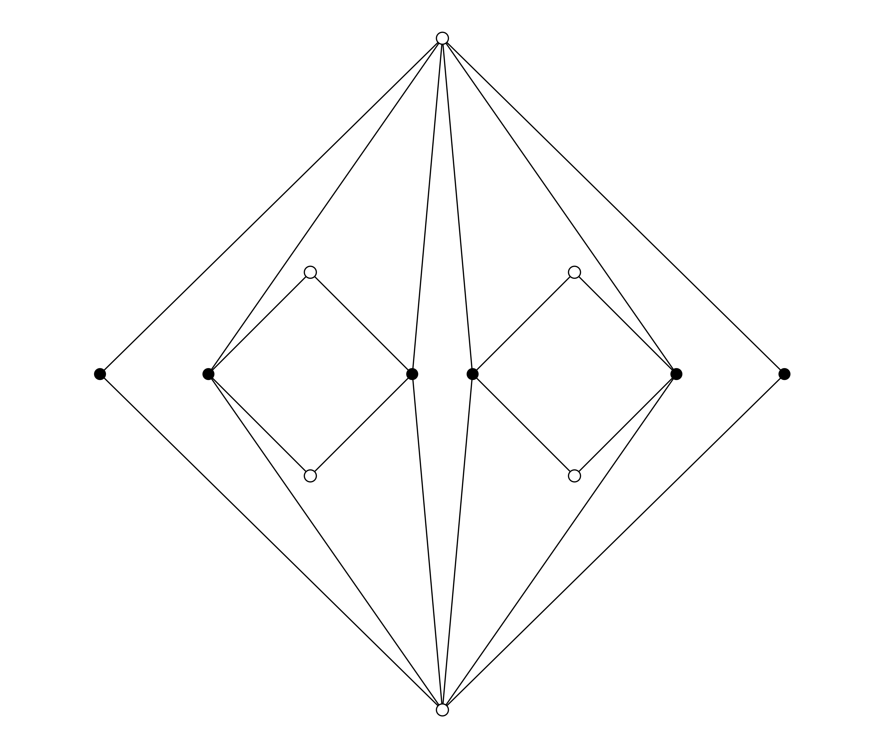
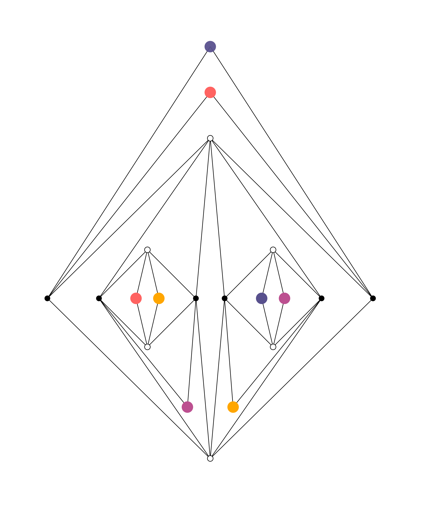

## The Problem

It is well known that one cannot connect each of three homes to each of three utilities, without any of the lines of connection crossing, if those lines are restricted to lie in a plane (or equivalently, on the surface of a sphere). Mathematically, we say that the complete bipartite graph $K_{3,3}$ is not planar.

However, it *is* possible to draw such a graph on the surface of a torus. Indeed, on a torus it is possible to connect each of four homes to each of four utilities, without any lines of connection crossing (an exercise for the curious).

A natural question to ask is: what is the surface of lowest genus $g$ on which it is possible to connect $n$ homes to $n$ utilities, without crossings?

## A Lower Bound

Here is a lower bound on the genus required. Suppose the complete bipartite graph $K_{n,n}$ can be drawn without crossings on the genus-$g$ surface. Let $e = n^2$ denote the number of edges in the graph, $f$ the number of faces, and let $\chi = 2 - 2g$ denote the Euler characteristic of the surface.

The shortest cycle in $K_{n,n}$ has length four. Thus each face of the graph must have at least four sides, and since each side is shared by two faces, we must have

$$ 2 e \geq 4 f  \ .$$

By definition, we have $2n - e + f = \chi$. Thus we can write the above inequality as

$$ \frac{e}{2} \leq 2n - \chi = 2(n + g - 1) \ .$$

Thus we find that

$$ g \geq \frac{(n-2)^2}{4} \ . $$

## An Upper Bound

Note that any finite graph can be drawn without crossings on a surface with sufficiently large genus. Roughly speaking, we can simply send each edge through its own handle, and so $g \leq e(G)$ gives a simple upper bound on the genus required.

To improve this bound, first consider the case that $n = 2m$ is even. By considering the houses in pairs, and likewise for the utilities, our task is to connect each house pair to each utility pair with a copy of $K_{2,2}$, of which there will be $m^2$ in total. Note that we can represent a $K_{2,2}$ passing through a handle like so:

Thus we can clearly draw our graph with $m^2$ handles like so ($m = 2$):

Here black dots indicate houses and white dots indicate utilities. This gives a simple upper bound (for $n$ odd or even) on the genus of

$$g \leq \lceil n/2 \rceil^2 \ .$$

## A Better Upper Bound

Let us pair the houses and utilities as before. We can easily draw $m$ copies of $K_{2,2}$ on the plane like so ($m=3$):

Indeed, we can add $m-1$ further copies of $K_{2,2}$ without difficulty:

We now claim that we can add the remaining $(m-1)^2$ copies of $K_{2,2}$ using $(m-1)^2$ handles:

Our minimum required genus is hence bounded above by $g \leq (m-1)^2 = (n-2)^2/4$. But this is precisely the lower bound on the genus we previously found! 

For $n$ odd I have not found so neat a solution. It seems clear that the genus required should be smaller than that for $K_{n+1,n+1}$, yet it may not be possible to achieve the lower bound described above (for one thing, it is impossible for every face to have four sides, since the number of edges is odd). More thought is required.

## A Partial Solution

We have found that when $n$ is even, the minimum genus required to draw $K_{n,n}$ without crossings is
$$ g = \frac{(n-2)^2}{4} \ . $$
Whilst for $n$ odd, we have found that this minimum genus lies in the range
$$ (n/2 - 1)^2 \leq g \leq (\lceil n/2 \rceil - 1)^2 \ .$$ 

Besides pinning down the case of odd $n$ precisely, a natural next question to ask is how this result extends to the graphs $K_{m,n}$ for $m \neq n$.

